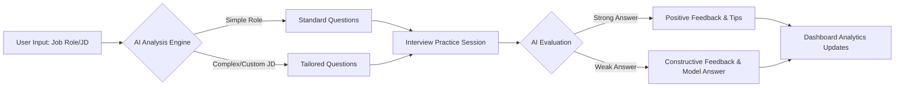

<div align="center">
  <h1>🤖 AI Interview Prep App</h1>
  <p><em>Your intelligent companion for acing any job interview with confidence.</em></p>

  <!-- Badges -->
  <p>
    
    
    
    
  </p>
</div>

---

## 📖 Overview

The **AI Interview Prep App** is an interactive, AI-powered platform designed to help job seekers prepare for interviews effectively. Whether you are aiming for a specific role or looking to practice based on a customized job description, this application tailors the experience to your needs. 

By leveraging cutting-edge LLMs (Large Language Models), the app generates realistic interview questions, provides high-quality model answers, and offers actionable feedback on your responses, turning every practice session into a stepping stone toward a successful career.

---

## ✨ Key Features

- **🎯 Role-Based Preparation**: Select from pre-defined job roles (e.g., Software Engineer, Product Manager, Data Analyst) to get tailored interview experiences.
- **📄 Resume & JD Integration**: Paste a specific Job Description or upload your resume for a hyper-personalized interview simulation.
- **❓ AI-Generated Questions**: Dynamic, context-aware interview questions ranging from technical to behavioral.
- **💡 Model Answers & Feedback**: Receive AI-generated "gold standard" answers alongside constructive feedback to refine your own responses.
- **🎨 Clean & Modern UI**: An intuitive, visually appealing, and responsive user interface that keeps the focus entirely on your preparation.

---

## 🛠️ Tech Stack

This project is built with a robust, scalable, and modern technology stack:

### **Frontend**
- **Languages**: HTML5, CSS3, JavaScript
- **Framework**: React.js
- **Styling**: Vanilla CSS / Custom Modern UI

### **Backend**
- **Language**: Python 3.x
- **Framework**: Django & Django REST Framework (DRF)

### **Database**
- **RDBMS**: MySQL

### **AI Integration**
- **APIs**: Anthropic Claude API / OpenAI API

---

## ⚙️ How It Works

1. **Input Context**: The user selects a target job role OR pastes a specific job description/resume.
2. **Contextual Analysis**: The Django backend sends this context to the integrated AI engine (Claude / OpenAI).
3. **Question Generation**: The AI generates a customized set of interview questions.
4. **Practice Mode**: The user attempts to answer the questions within the application.
5. **Evaluation**: The app analyzes the user's answers against AI-generated model answers.
6. **Detailed Feedback**: The user receives a comprehensive report outlining areas of strength and actionable suggestions for improvement.

### The Flow


---

## 🚀 Installation & Setup

Follow these steps to get the project up and running on your local machine.

### Prerequisites
- Node.js & npm installed (for frontend)
- Python 3.8+ installed (for backend)
- MySQL Server installed and running
- API Keys for OpenAI or Anthropic (Claude)

### 1. Clone the Repository
```bash
git clone https://github.com/yourusername/ai-interview-prep-app.git
cd ai-interview-prep-app
```

### 2. Backend Setup (Django + Python)
Navigate to the backend directory:
```bash
cd backend
python -m venv env
source env/bin/activate  # On Windows: env\Scripts\activate
pip install -r requirements.txt
```

**Environment Variables:**
Create a `.env` file in the `backend/` directory and add your credentials:
```ini
SECRET_KEY=your_django_secret_key
DEBUG=True
DB_NAME=interview_db
DB_USER=root
DB_PASSWORD=your_mysql_password
DB_HOST=localhost
DB_PORT=3306
AI_API_KEY=your_openai_or_claude_api_key
```

**Run Database Migrations & Start Server:**
```bash
python manage.py migrate
python manage.py runserver
```

### 3. Frontend Setup (React + JS)
Open a new terminal and navigate to the frontend directory:
```bash
cd frontend
npm install
npm install dotenv # If using env variables in react
npm start
```
*The app should now be running at `http://localhost:3000` and the API at `http://localhost:8000`.*

---

## 🕹️ Usage Guide

1. **Sign Up / Log In**: Create an account to save your interview history and track progress.
2. **Start a Session**: Click on "New Interview Practice" on the dashboard.
3. **Configure Settings**: Select your target job title, or paste the job description text.
4. **Answer Questions**: Read the generated question, record/type your answer, and submit.
5. **Review Feedback**: Check your performance score, read the model answer, and learn from the AI's personalized tips.

---

## 📂 Project Structure

```text
AI-Interview-Prep-App/
│
├── backend/                 # Django Application
│   ├── manage.py
│   ├── core/                # Django project settings
│   ├── api/                 # Django REST API app
│   └── requirements.txt     # Python dependencies
│
├── frontend/                # React Application
│   ├── public/
│   ├── src/
│   │   ├── components/      # Reusable UI components
│   │   ├── pages/           # Application views
│   │   ├── services/        # API call handlers
│   │   ├── App.js
│   │   └── index.css        # Global Styles
│   └── package.json         # Node.js dependencies
│
└── README.md                # Project documentation
```

---

## 🔮 Future Improvements

- [ ] **Voice Recognition (Speech-to-Text)**: Allow users to answer questions verbally.
- [ ] **Mock Video Interviews**: Integrate real-time avatar or webcam analysis for body language feedback.
- [ ] **Performance Analytics Dashboard**: Visual charts to track improvement over multiple sessions.
- [ ] **Community Forum**: A space for users to share difficult interview experiences and tips.

---

## 📸 Screenshots

*(Replace with actual URLs once the project is deployed or screenshots are taken)*

| Dashboard Overview | Interview Session |
| :---: | :---: |
|  |  |

| Feedback & Evaluation | Job Description Setup |
| :---: | :---: |
|  |  |

- **📊 Progress Dashboard**: Track your interview performance over time with visual analytics and scores.
- **⏱️ Timed Sessions**: Simulate real interview pressure with customizable time limits per question.
- **🎙️ Speech-to-Text Integration**: Answer questions verbally for an even more authentic interview practice experience.

## 📜 License

Distributed under the MIT License. See `LICENSE` for more information.

---

## 👤 Author

**Your Name**
- 🌐 Portfolio: [your-portfolio.com](https://your-portfolio.com)
- 💼 LinkedIn: [LinkedIn Profile](https://linkedin.com/in/yourusername)
- 🐈 GitHub: [@yourusername](https://github.com/yourusername)

<p align="center">
  <br>
  ⭐️ If you find this project useful, please consider giving it a star!
</p>
